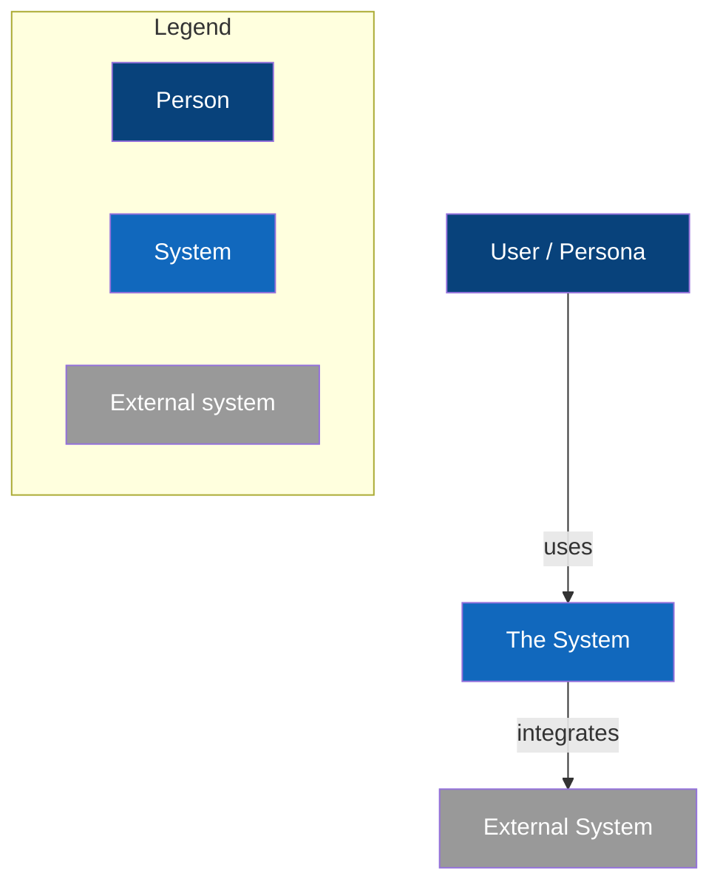
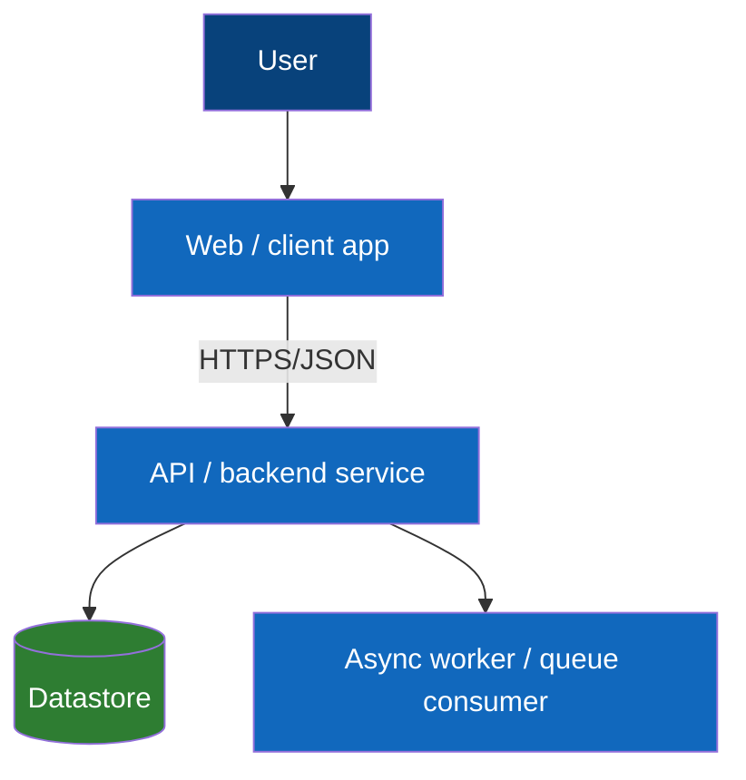

# C4 — <system / context name>

> Owner: Architecture (`domain-model`). Simon Brown: one diagram = one level of abstraction; legend; consistent notation.
> Keep these current — a stale diagram scores against *Architectural soundness*.

## Level 1 — System Context

## Level 2 — Containers

> Replace the placeholder containers with the project's real ones. Add Level 3 (Components) and Level 4 (Code)
> only when they earn their keep (YAGNI).
