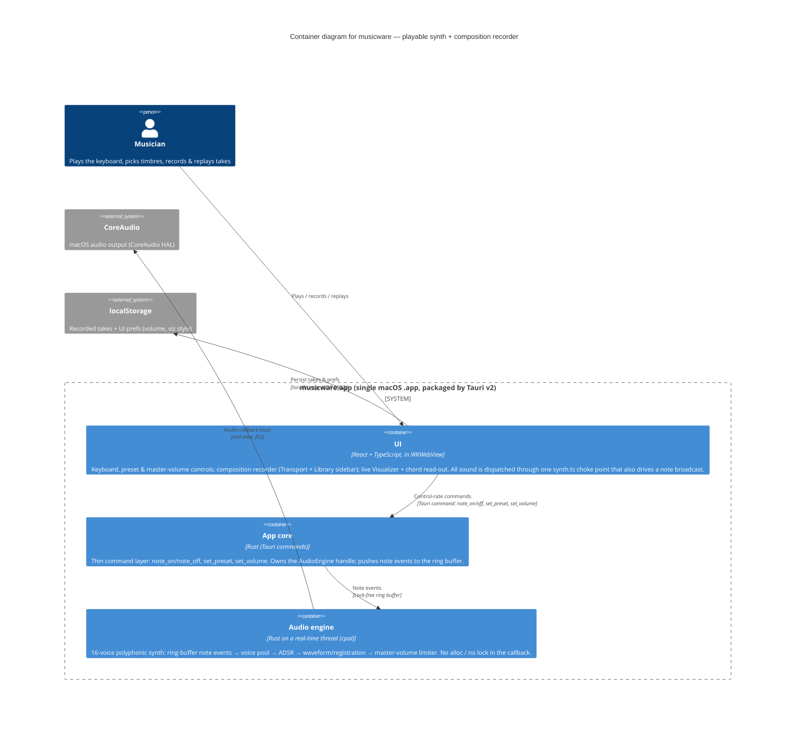

# C4 — Container view (musicware)

> Level 2 (Container) of the [C4 model](https://c4model.com). Reflects [ADR-0001](../decisions/ADR-0001-react-tauri-rust-audio-engine.md)
> (UI/engine split), [ADR-0002](../decisions/ADR-0002-composition-recording-frontend-event-stream.md) (frontend recorder),
> [ADR-0003](../decisions/ADR-0003-master-volume-post-render-limiter.md) (master volume), and
> [ADR-0004](../decisions/ADR-0004-visualizer-note-broadcast-representation.md) (note-driven visualizer).
> One level of abstraction per diagram. Glossary: [docs/CONTEXT.md](../../CONTEXT.md).
> As-built for the playable-synth track (PRD-002/PRD-003); the broader recording-DAW vision (mic capture,
> mixdown, timeline) from PRD-001 is not yet built and is omitted here.

## UI components (Component level, prose)
- **Keyboard** — on-screen + computer-key input; highlight driven by `useActiveNotes`.
- **Recorder** — `useRecorder` (one instance in App) captures the synth event stream and replays it by
  re-dispatch; **Transport** (record control, top bar) + **Library** (takes sidebar, undo toast).
- **Visualizer** + **ChordDisplay** — both read `useActiveNotes` (the shared note broadcast), so they
  react to live play *and* replay. The visualizer is a **representation synthesised from note pitches**,
  not the audio signal (ADR-0004).
- **PresetSelector / VolumeControl** — dispatch `set_preset` / `set_volume`; the preset selector also
  follows the preset broadcast so it re-highlights during replay.

## Legend / key decisions
- **Audio samples never cross to the UI** (ADR-0001). The UI sends control commands only; it currently
  receives **no** Rust→UI events (no playhead/meters are implemented yet). The visualizer and chord
  read-out are driven entirely by the UI's own note broadcast, not by the engine (ADR-0004).
- The **real-time thread** must never block, lock, or allocate — the **ring buffer** is the only channel
  into it. The master volume is a post-render limiter that hard-clamps the output (ADR-0003).
- **Recording is frontend-only** (ADR-0002): captured note/preset events are timestamped and replayed by
  re-dispatch; takes live in localStorage. The engine is untouched by recording.

## Fitness function
Glitch-free playback at a 512-sample buffer under 16-voice polyphony with **0 underruns**. Now exercised
**on every push** by the CI `audio-smoke` job (BlackHole virtual device, holding the additive Organ
preset — DEBT-015); the full 60 s audible run remains a developer acceptance (DEBT-009).
