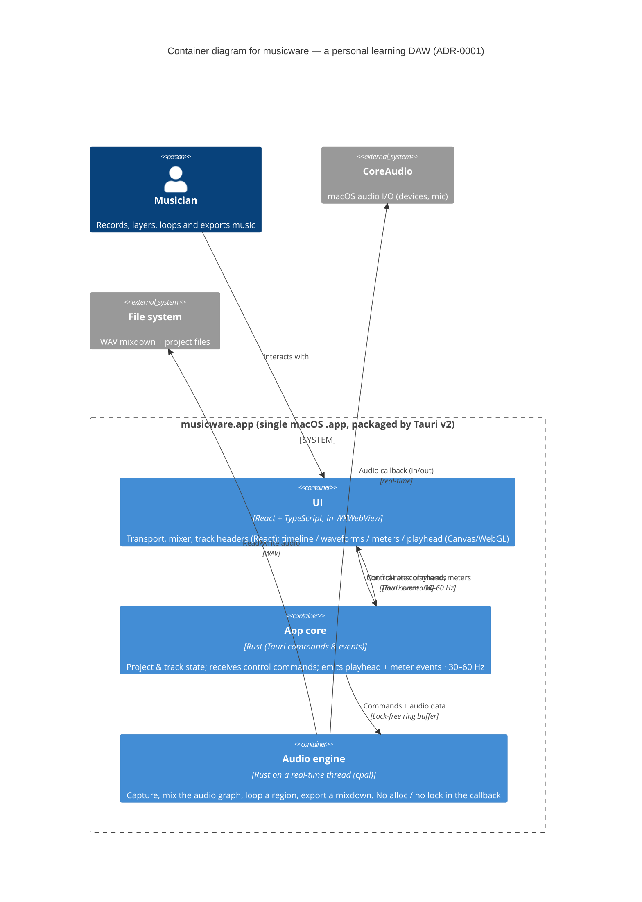

# C4 — Container view (musicware)

> Level 2 (Container) of the [C4 model](https://c4model.com). Reflects [ADR-0001](../decisions/ADR-0001-react-tauri-rust-audio-engine.md).
> One level of abstraction per diagram. Glossary: [docs/CONTEXT.md](../../CONTEXT.md).

## Legend / key decisions (per ADR-0001)
- **Audio samples never cross to the UI.** The UI only sends control commands and receives low-rate state (playhead, meter levels). This is what keeps the React↔Rust boundary cheap.
- The **real-time thread** (audio callback) must never block, lock, or allocate — violating that causes an **underrun**. The **ring buffer** is the only channel between the app core and that thread.
- No Python. A future out-of-process **sidecar** (for non-real-time extensions only) would appear here as another container; it is out of scope today.

## Fitness function
Glitch-free playback at a 512-sample buffer for 60 s with **0 underruns** on Apple Silicon (carried as DEBT-008; to be promoted to a runnable acceptance spec during the vertical slice).
